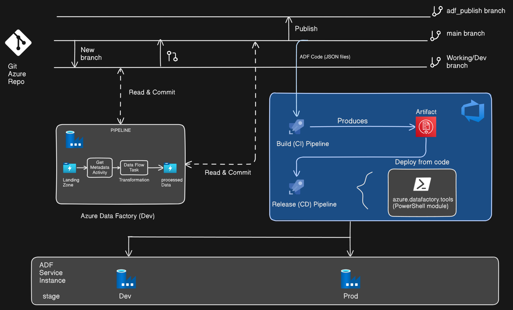
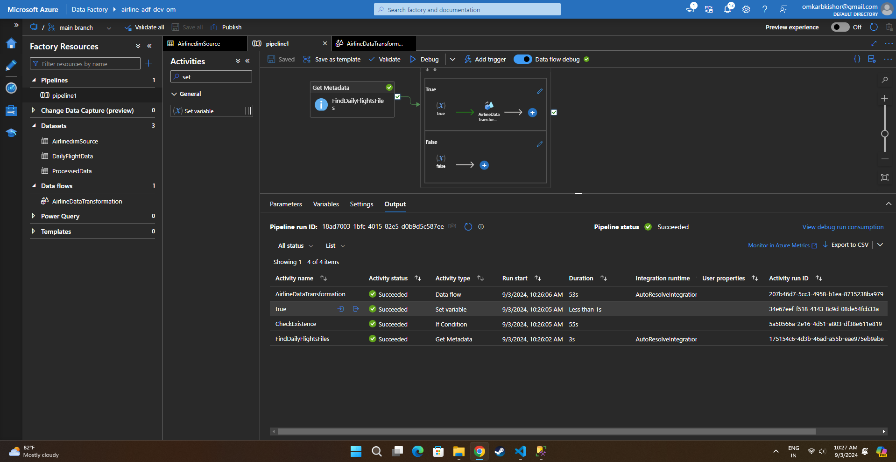
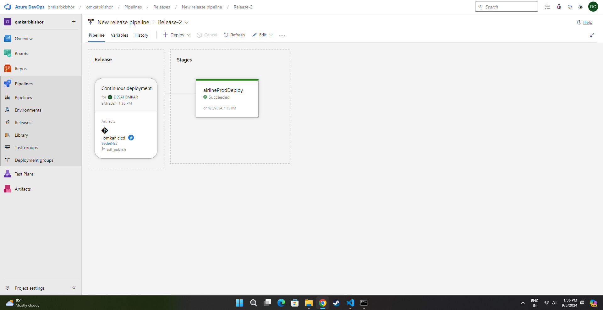

# Azure Data Factory CI/CD ETL Project

## Table of Contents
- [Project Overview](#project-overview)
- [Architecture](#architecture)
- [Tech Stack](#tech-stack)
- [Pipeline Workflow](#pipeline-workflow)
- [CI/CD Implementation](#cicd-implementation)
- [Challenges and Solutions](#challenges-and-solutions)
- [Screenshots](#screenshots)
- [Contact](#contact)

## Project Overview
This project demonstrates the implementation of an ETL pipeline with CI/CD practices using Azure Data Factory and Azure DevOps. The project involves creating separate development and production environments, building a data pipeline, and deploying it through an automated release pipeline using ARM templates.

## Architecture

## Tech Stack
- **Languages**: SQL, ARM Templates
- **Azure Data Factory**: Used to create and manage ETL pipelines.
- **Azure Data Lake Storage**: Storage for input and output files.
- **Azure DevOps**: Configured for CI/CD, including source control and release pipelines.
- **Self-hosted Agent**: For running Azure DevOps pipelines.

## Pipeline Workflow
1. **Development Environment**:
    - **Setup**: Two Azure Data Factory instances are created: one for development and one for production, mimicking a real-life scenario.
    - **Git Integration**: Git is configured in Azure DevOps for version control of the pipeline.

2. **Pipeline Activities**:
    - **Get Metadata Activity**: Checks the existence of files in Azure Data Lake Storage.
    - **If Condition Activity**: Evaluates the metadata to determine if the file exists, proceeding with the pipeline if true.
    - **Data Flow Activity**:
        - **Source**: Ingests data from two CSV files (Flight Data and Airports Data).
        - **Join Transformation**: Performs an inner join on the two datasets.
        - **Select Transformation**: Selects the required columns.
        - **Second Join and Select Operations**: Further joins and selects to refine the dataset.
        - **Sink**: Stores the transformed data back into Azure Data Lake Storage in the form of CSV files.

## CI/CD Implementation
1. **Agent Configuration**:
    - **Self-hosted Agent**: A self-hosted agent is configured on a local machine to execute the Azure DevOps pipeline.
    - **Azure DevOps Pipeline**:
        - **Artifacts**: The `adf_publish` branch is selected for artifacts generated from the published changes in Azure Data Factory.
        - **Tasks**:
            - **Agent Selection**: The self-hosted agent is used.
            - **ARM Template Deployment**: Deploys the environment using ARM templates with parameters such as storage key and Azure Data Factory name, ensuring that the same environment is replicated in production.

2. **Release Pipeline**:
    - **Stages**: Development and Production stages are set up to deploy changes incrementally.
    - **Deployment**: The pipeline automates the deployment of Azure Data Factory pipelines from development to production.

## Challenges and Solutions
**Challenge 1**: Managing and synchronizing changes across different environments.
- **Solution**: Utilized ARM templates to ensure consistent deployment across both development and production environments.

**Challenge 2**: Configuring a self-hosted agent for Azure DevOps.
- **Solution**: Successfully configured a self-hosted agent on a local machine, enabling controlled execution of the pipeline.

## Screenshots
1. **Pipeline Structure**:
    - 
    - Screenshot of the ETL pipeline setup in Azure Data Factory.

2. **DevOps Pipeline**:
    - 
    - Screenshot of the release pipeline in Azure DevOps, showcasing the CI/CD process.

## Contact
For more information or to connect with me:

- **LinkedIn**: [https://www.linkedin.com/in/omkar-desai-0075a7192/](#)
- **Email**: [https://mail.google.com/mail/u/0/#inbox](#)
